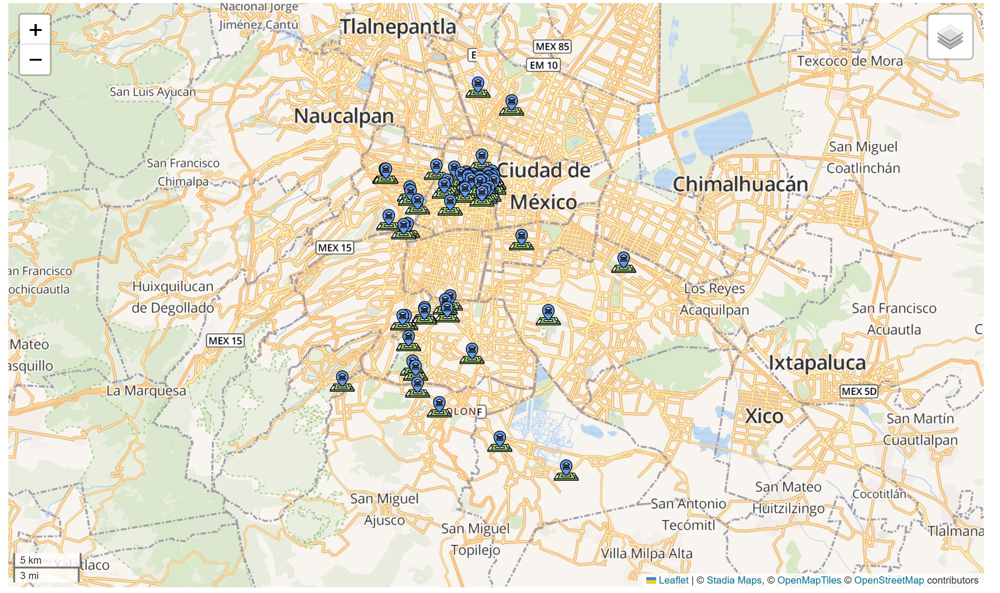
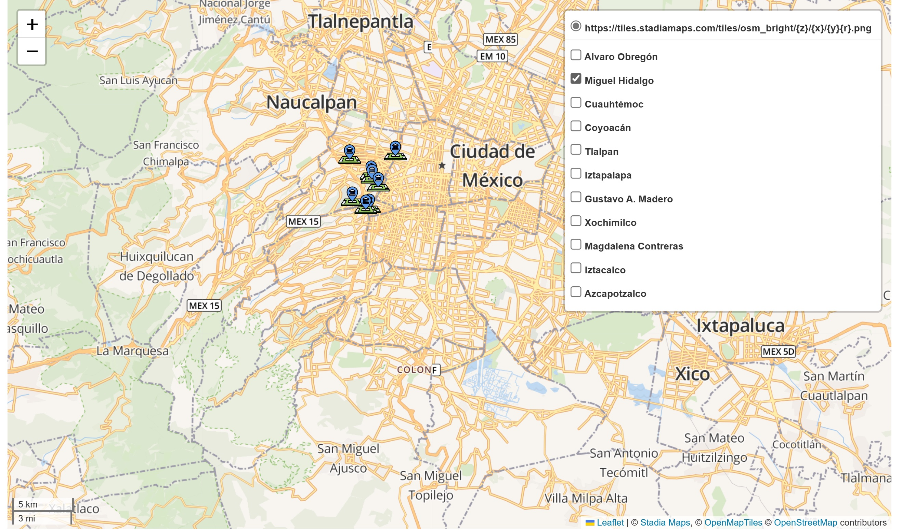
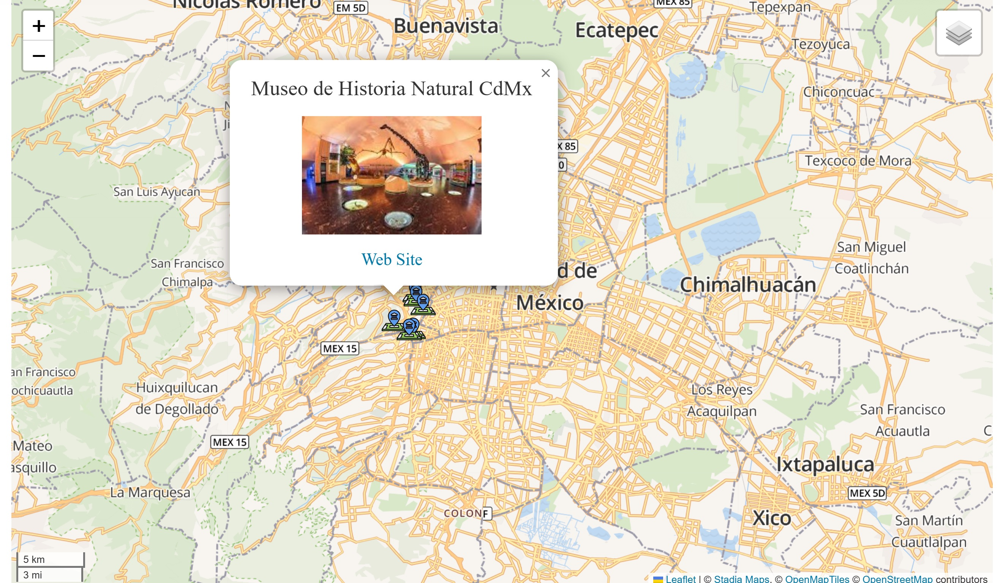

## Interactive Map of Museums in Mexico City
This project uses Geopy, Geopandas and Folium to generate an interactive map with markers of the main museums in Mexico City and pop-up windows that show the names, images, and websites of the museums, which you can consult by town hall.

### Requirements
- Geopy
- Geopandas
- Folium

### Usage
- Clone or download the repository to your local machine
- Install the required packages using pip install -r requirements.txt
- Run the map.py file to generate the interactive map

### Data
The museum data used in this project is stored in the museums_Mexico_City.csv file. This file contains for each museum: the name, image URL, website URL, as well as data about if the museum has terrace and I have visit it.

### Output
The output of this project is an interactive map with markers of the main museums in Mexico City and pop-up windows that show the names, images, and websites of the museums. 
The map can be used to easily explore the museums in Mexico City and learn more about each one.

Here's a preview of what the map looks like:

You can select a Town Hall.

And an example of pop-up windows:

